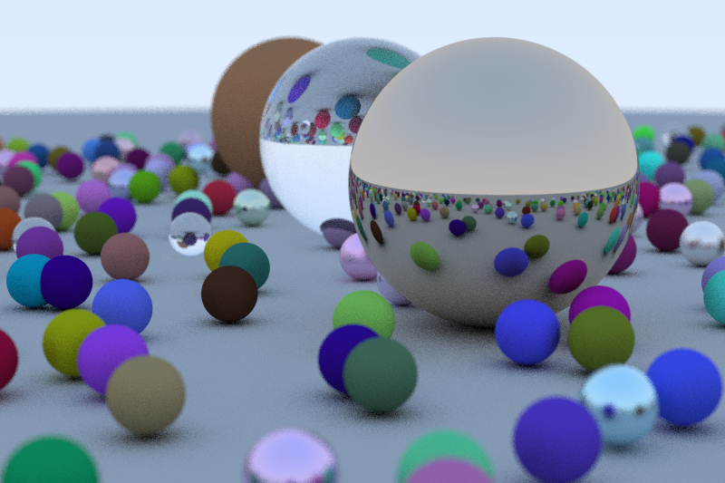

# Raytracing in a weekend

My attempt at re-implementing [raytracing-in-a-weekend](https://github.com/RayTracing/raytracing.github.io/) and at the same time learning about Rust.

## Final image
800x600 pixels with a 3/2 aspect ratio and 50 samples per pixels, takes about ~25 minutes to generate on the CPU :sweat_smile:

